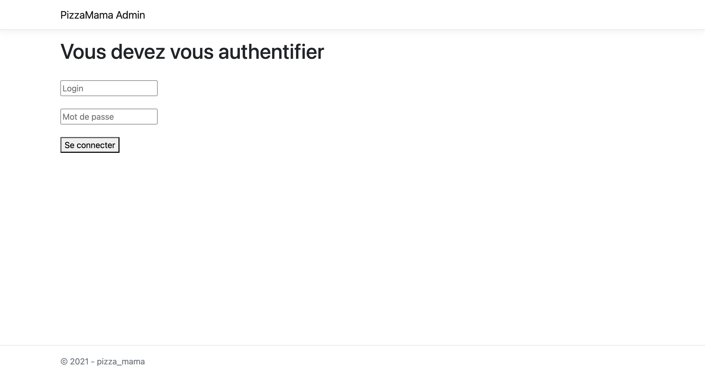

°Cette image représente l'architecture globale du projet Pizza Mama. Elle montre la structure du projet,
ses différents composants (backend, frontend, base de données) et comment ils interagissent.
Cela inclut les différentes couches (base de données, API, interface utilisateur) et les technologies utilisées.

°Ceci est une capture d'écran de la page d'accueil du site web  Pizza Mama. 
On y voit l'interface utilisateur principale avec un design accueillant, 
un accès rapide a la section principale telle que le menu des pizzas.

°Ici, tu peux voir la page du menu des pizzas. Cette section présente une liste des pizzas disponibles, 
avec des informations sur leurs noms, prix, 
ingrédients et si elles sont végétariennes ou non. 
C'est l'interface principale pour les clients souhaitant passer une commande.

